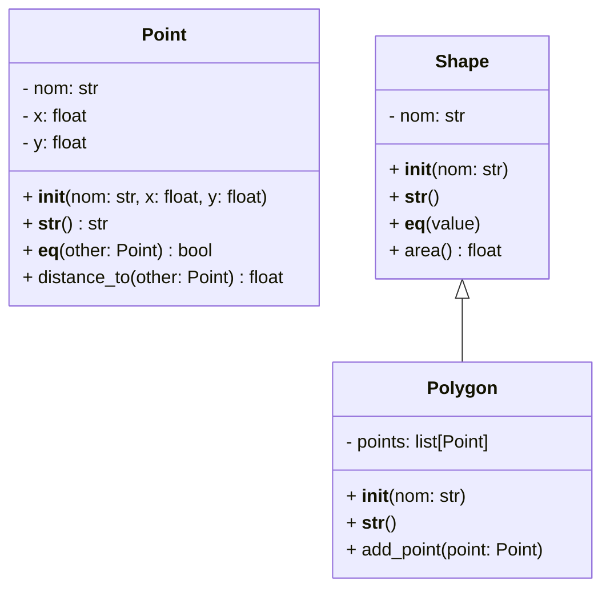

```mermaid

classDiagram
  class Point {
    - nom: str
    - x: float
    - y: float
    + __init__(nom: str, x: float, y: float)
    + __str__() str
    + __eq__(other: Point) bool
    + distance_to(other: Point) float
  }

  class Shape {
    - nom: str
    + __init__(nom: str)
    + __str__()
    + __eq__(value)
    + area() float
  }

  class Polygon {
    - points: list[Point]
    + __init__(nom: str)
    + __str__()
    + add_point(point: Point)
  }

  Shape <|-- Polygon

```